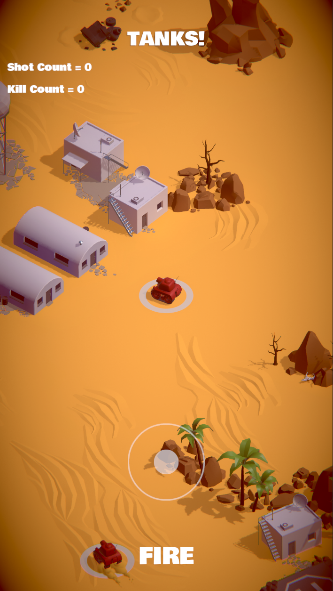
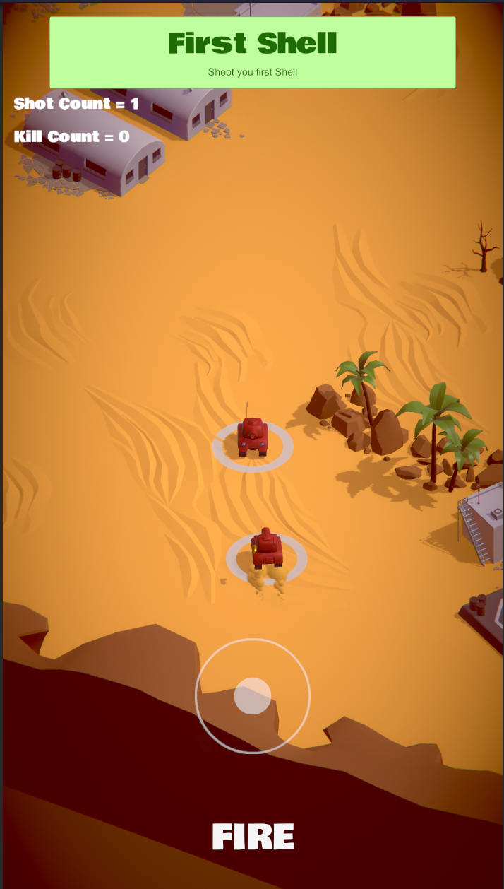
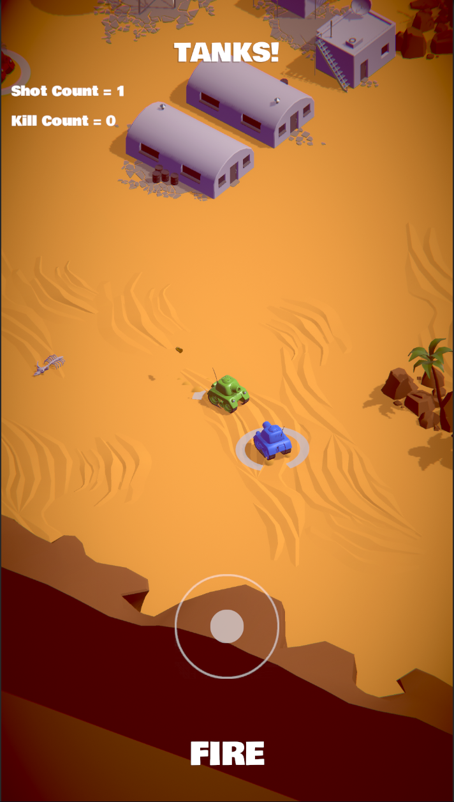
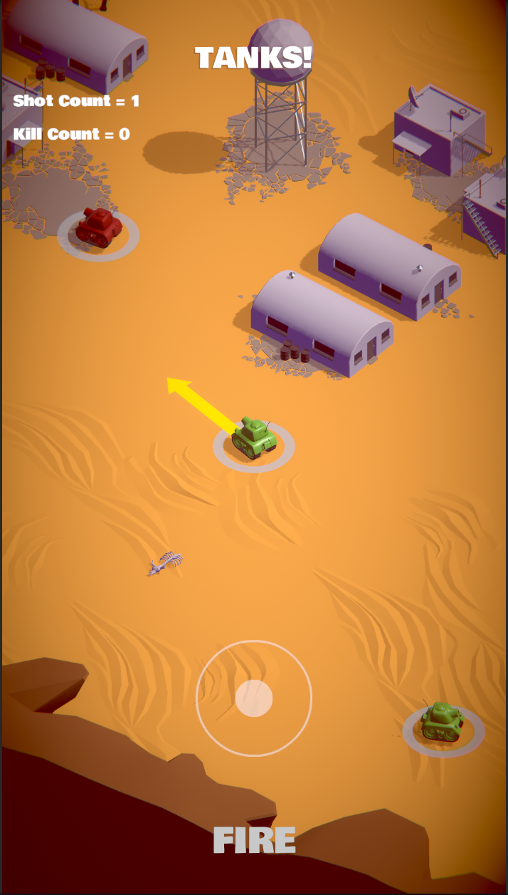

# TanksBattle Unity3D
 This is a tank battle game created with unity.
 This game implements code architecture which is scalable and easliy modifyable.
 
 # Features
 - Movement with joystick.
 - Dynamic shooting for player.
 - AI enemy with idle, partol, chase and shoot states.
 - Accurate enemy aiming system.
 - Achievement system
 
 # Design patterns
- Singleton
- Observer
- Factory
- MVC
- StateMachine
- Object pooling

# Gameplay

